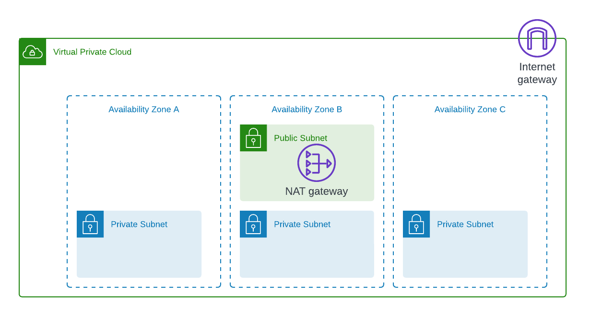
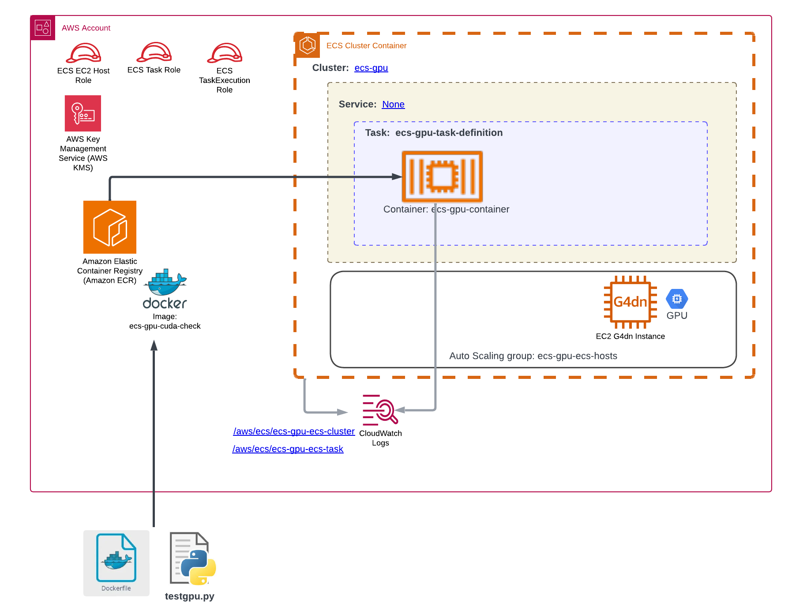

# Overview  

Please see blog site (https://devbuildit.com/2025/01/05/aws-ecs-with-gpu-access/) for detailed explaination of this repo contents.

This repo (and associated blog) will help you to setup an environment to conduct experiments using AWS ECS infrastructure where GPU access is required. The base network infrastructure is shown below:

Additional, the following ECS Intrastructure will be deployed:

# Installation  

Please see https://devbuildit.com/2025/01/05/aws-ecs-with-gpu-access/ for detailed explaination.

## Requirements: ##
- AWS Account
- Terraform CLI installed with access to your target AWS account (via temporary Indentity centre credentials or AWS IAM access keys)

## Deployment (Terraform)
- Clone repo into a source folder
- Update file variable.tf with default region (otherwise this will deploy to ap-southeast-2 by default) and required vpc networking CIDRs
- Consider changing application name in file variables.tf (default will work fine)
- Run command 'Terraform init' in source folder
- Run command 'Terraform plan' in source folder
- Run command 'Terraform apply' in source folder and approve apply

## Deployment (Docker Image)
Create docker image as described in the repo docker subfolder.  Upload docker image to ECR

## Testing
Create an ECS task based on the task definition created in the deployment section.  Run the task within the priviate subnets created in the deployment section.

## Removal
- Remove Docker images from AWS ECR
- Run command 'Terraform destroy'